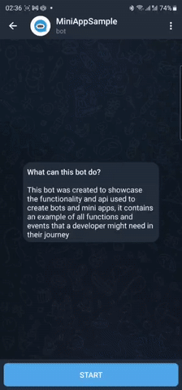

# telegram-mini-app
This repository was created to showcase the functionality and api used to create bots and mini apps, it contains an example of all functions and events that a developer might need in their journey



To try this bot and its mini app on production servers please visit https://t.me/mini_app_sample_bot and run the `/start` command
> Since the free render.com is used for hosting the bot, sometimes the server might be unavailable, please contact me for redeploy

If you also want to create a bot, please follow the instruction below

## Stack
The goal of this repository is to make it easier to try different functionality of mini apps and bot api, therefore, a single programming language and a similar set of technologies were chosen.

### Backend
- NodeJS with JavaScript
- `telegraf` and `typegram` for communication with Bot API
- `dotenv` for environment variables
- `express` and `cors` for REST API
- render.com for easy and free deploy from Github repository

### Web App
- React with JavaScript
- Telegram MiniApp script from https://telegram.org/js/telegram-web-app.js
- `router-dom` for navigation
- netlify.com for easy and free deploy from Github repository

## Setup your own MiniApp
If you also want to create a bot, please follow the instruction below

### Create a Bot
In order to create a mini app, you need to have a bot that will host it. 
If you're new to the Bot API, please [see the manual ](https://core.telegram.org/bots)

Creating a bot is pretty straight forward, search for [@BotFather](https://t.me/BotFather) on Telegram, and follow the instructions:

1. Click the `START` button, or send a message with the  `/start` command to begin interacting with the bot father

2. If you already had an interaction with the bot, just send the `/help`  command instead

3. Bot father will reply with a list of commands that you can use, click on  `/newbot` or send it as a message to the chat

4. Bot father will ask you to choose a name for the new bot, in our example, we used `MiniAppSample`

5. Then, you will need to choose a username, in our example, we used `mini_app_sample_bot`

6. After that, our bot will be successfully created, you can find it at `t.me/mini_app_sample_bot`, make sure to replace `mini_app_sample_bot` with the username you entered

7. Bot father will send you a token that looks similar to this:
`0000000000:XXX0xX0XXXXX0XXXXXxxxxxxxxxx0XXxX0x`
  It will be used to access the HTTP API, keep your token secure and store it safely, it can be used by anyone to control your bot

For a description of the Bot API, [see this page](https://core.telegram.org/bots/api)

### Create a WebApp
The next step of creating a mini app registering a web app to our bot. This process is also straight forward, follow the instructions:

1. From the list of commands of the [@BotFather](https://t.me/BotFather), click on  `/newapp` or send it as a message to the chat

2. You will be asked to choose a bot, send its username to the chat. In our example, we used `@mini_app_sample_bot`

3. Bot father will ask you to enter a title, in our example we used `MiniAppSample`

4. Then, you will need to enter a description, write something that describes the functionality of your app and the benefits that it will bring to its users

5. You will be asked to upload a 640x360 photo, just send it to the chat. For the GIF step, you can send `/empty` for now

6. Bot father will ask you to send a URL that points to the website hosting the mini app. `https`, for example `https://miniappsample.com`. You will need this URL later on to deploy your app.

7. Then, you will be asked to choose a short name for the web app, which will be used in direct URLs that start the app directly. We used `mini_app_sample` so our URL looks like this `t.me/mini_app_sample_bot/mini_app_sample`

That’s it! You can now start writing code and testing your Mini App!

### Quick Backend and WebApp setup
If you want to quickly start developing your mini app, you can just clone the template folder from this repository, then follow these steps to link it to your bot and deploy it

First, clone the `template` folder from the root of this repository, you will get some dummy code for both backend and web app, then follow the steps for each platform

#### Backend
1. Inside the `backend/` folder, create `.env` file and put your bot token like this:
```env
BOT_TOKEN=0000000000:XXX0xX0XXXXX0XXXXXxxxxxxxxxx0XXxX0x
APP_URL=https://www.yoururl.com/
```
> Don't forget to replace the value of the token, with the one you received from bot father
> The app URL is the link that will open your mini app after deploy

2. Run `npm install` 

3. Push the data to your own Git repository

4. Then deploy your backend to `localhost` using `npm start`, or to render.com, and start using it

That's it!

### WebApp
1. Inside the `web/` folder, go to [Variables.js](./template/web/src/logic/server/Variables.js) and change `API_URL` to the URL of your bot's server

2. Run `npm install`

3. Now you need to deploy your webApp to `netlify.com`

4. After that, use the link to setup a menu app for your mini app through [@BotFather](https://t.me/BotFather)


### Setup Backend and WebApp from scratch
You can create a fresh project for your bot and mini app, even tho the template is already clean and ready for development

### Backend
1. Inside a new project folder, create `/backend` directory

2. Go to this directory and init a NodeJS project
`npm init -y`

3. Create `src/index.js` file, then mention it inside your `package.json` like this:
```json
{
    "main": "src/index.js"
}
```

4. Install `nodemon` for realtime updates on the dev environment
`npm i -D nodemon`

5. Install `dotenv` for using environment variables
`npm i dotenv --save`

6. Change scripts block to run `dotenv` on start
```json
{
    "scripts": {
        "start": "node -r dotenv/config src/index.js",
        "start:dev": "nodemon --exec \"npm start\""
    }
}
```

7. Install bot API libraries
`npm i telegraf`
`npm i typegram`

8. Create `.env` file and add bot token and app url
```env
BOT_TOKEN=
APP_URL=
```

9. Run save types 
`npm i —save-dev @types/node`

10. Install `express` and `cors` for REST api
`npm install express`
`npm install cors`

11. Deploy to `localhost` or to render.com

That's it for the backend side, start coding! Don't forget to read [Telegraf Docs](https://telegraf.js.org/) and [Official Bot API](https://core.telegram.org/bots/api)

### WebApp
Using React is more straight forward when it comes to creating a new project

1. Inside a new project folder, create `/web` directory

2. Go to this directory and init a NodeJS project
`npx create-react-app .`

3. Go to [Telegram Mini Apps](https://core.telegram.org/bots/webapps#initializing-mini-apps)

4. Copy this script tag and paste it inside the `<head>` tag in `index.html`
```html
<script src=“https://telegram.org/js/telegram-web-app.js”></script>
```

5. Download the library to use inside the IDE

6. Deploy to netlify.com

That's it for the web side, start coding! Don't forget to read the [Official Docs](https://core.telegram.org/bots/webapps)

## Docs
The code inside the sample app was organized and documented to be understood easily, it also provides links and references to the main Telegram docs

You can visit these folders, and take a look on the code for more information

### Backend
- [Bot Interaction](./sample/backend/src/telegram/Bot.js)
- [REST API](./sample/backend/src/http/Api.js)
- [Application Start](./sample/backend/src/app/Application.js)

### WebApp
- [Mini App Data](./sample/web/src/screens/data/DataScreen.jsx)
- [Mini App Functions](./sample/web/src/components/app/functions)
- [Main and Back Buttons](./sample/web/src/components/app/button)
- [Haptic Feedback](./sample/web/src/components/app/haptic)
- [Server Communication](./sample/web/src/components/app/server)
- [HttpClient](./sample/web/src/logic/server/HttpClient.js)
